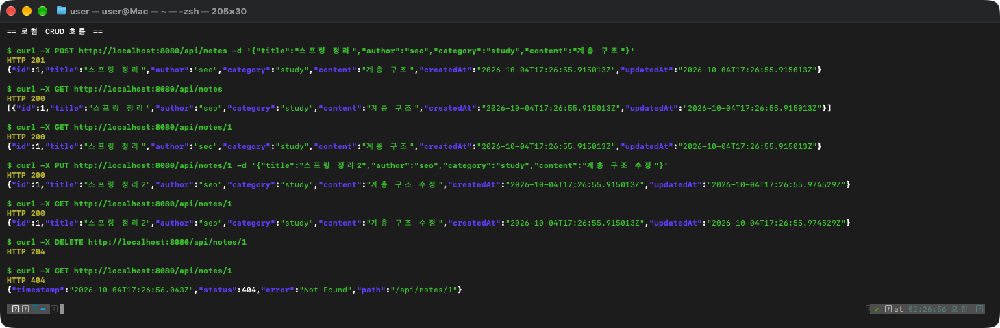
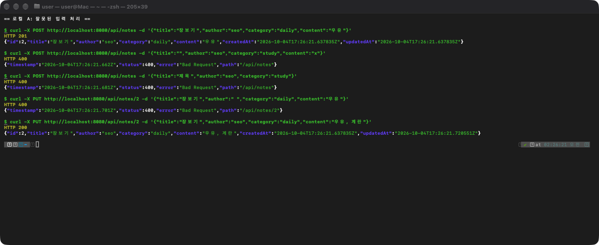
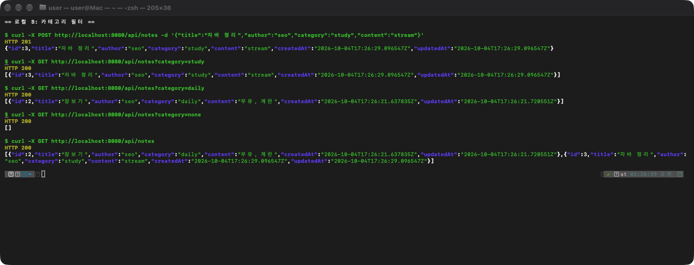
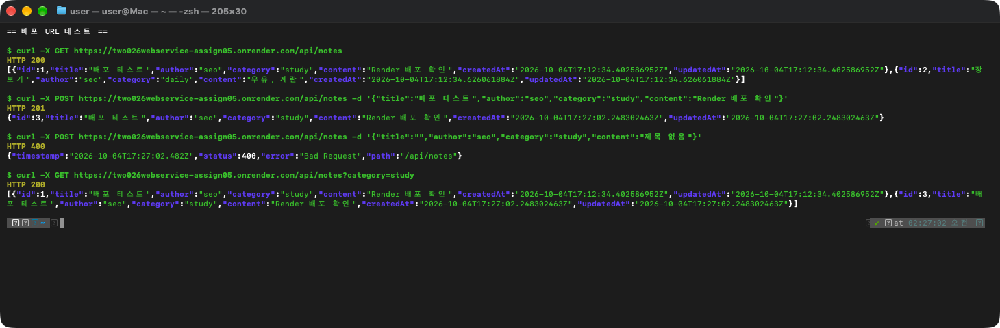

# simple_note

## ① 프로젝트 소개

간단한 메모(노트)를 등록·조회·수정·삭제하는 REST CRUD API입니다. DB 없이 메모리에 저장합니다.

**관리하는 데이터 (Note)**

| 필드 | 타입 | 설명 |
|---|---|---|
| id | Long | 자동 생성 |
| title | String | 제목 |
| author | String | 작성자 |
| category | String | 카테고리 |
| content | String | 내용 |
| createdAt | Instant | 생성 시각 (저장 시 자동 입력) |
| updatedAt | Instant | 수정 시각 (저장 시 자동 입력) |

**프로젝트 구조**

```
src/main/java/com/seohamin/simple_note
├── SimpleNoteApplication.java
├── controller/NoteController.java
├── service/NoteService.java
├── repository/NoteRepository.java        (인터페이스)
├── repository/MemoryNoteRepository.java  (LinkedHashMap 저장소)
├── domain/Note.java
└── dto/NoteRequestDto.java, NoteResponseDto.java
```

**로컬 실행 방법**

```bash
./gradlew bootRun
# http://localhost:8080/api/notes
```

**API Endpoint**

| Method | URL | 기능 | 응답 |
|---|---|---|---|
| POST | `/api/notes` | 등록 | 201 / 400 |
| GET | `/api/notes` | 전체 조회 | 200 |
| GET | `/api/notes?category={category}` | 카테고리 필터 조회 | 200 |
| GET | `/api/notes/{id}` | 단건 조회 | 200 / 404 |
| PUT | `/api/notes/{id}` | 수정 | 200 / 400 / 404 |
| DELETE | `/api/notes/{id}` | 삭제 | 204 / 404 |

**요청·응답 예시**

```json
// POST /api/notes 요청
{ "title": "스프링 정리", "author": "seo", "category": "study", "content": "계층 구조" }

// 201 응답
{ "id": 1, "title": "스프링 정리", "author": "seo", "category": "study", "content": "계층 구조",
  "createdAt": "2026-10-04T16:43:36.515381011Z", "updatedAt": "2026-10-04T16:43:36.515381011Z" }
```

**URL**

- GitHub (Organization): https://github.com/2026-2-WebService/assign05-c01-22300378
- GitHub (Personal): https://github.com/ggm77/2026WebService_assign05
- 배포 URL: https://two026webservice-assign05.onrender.com

## ② 개발환경 및 Dependency

| 항목 | 작성 내용 |
|---|---|
| IDE | IntelliJ IDEA 2026.2.3 |
| JDK | 17 (Gradle toolchain, 로컬 OpenJDK 17.0.20.1 / Docker eclipse-temurin:17) |
| Spring Boot | 4.1.1 |
| Build Tool | Gradle 9.7.1 (Gradle Wrapper) |
| 데이터 저장 | `LinkedHashMap<Long, Note>` |
| 배포 환경 | Render (Docker, Free) - https://two026webservice-assign05.onrender.com |

**Dependency**

- `spring-boot-starter-webmvc` (Spring Web): `@RestController`로 REST API를 만들고, 내장 Tomcat으로 서버를 실행하고, 요청·응답 JSON을 DTO로 변환하기 위해 사용했습니다.
- `spring-boot-starter-webmvc-test`: 프로젝트 생성 시 기본으로 추가된 테스트 의존성이며, `contextLoads()` 테스트에 사용됩니다.

## ③ Solution 분석

**Q1. POST /api/books 요청은 어떤 순서로 처리되나요?**

`BookController.create()` → `BookService.create()` → `MemoryBookRepository.save()` 순서로 처리됩니다. Service에서 `BookRequest`로 `Book`을 만들어 저장하고, 결과를 `BookResponse`로 바꿔 201로 반환합니다.

**Q2. BookRequest, Book, BookResponse의 역할은 무엇인가요?**

`BookRequest`는 클라이언트가 보내는 데이터(id 없음), `Book`은 저장소에 저장되는 객체, `BookResponse`는 클라이언트에게 돌려주는 데이터(id 포함)입니다.

**Q3. 새 데이터의 ID는 어디서 생성되나요?**

`MemoryBookRepository.save()`에서 `++sequence` 값을 `setId()`로 넣어줍니다. 삭제해도 sequence는 줄지 않기 때문에 삭제된 ID는 다시 사용되지 않습니다.

**Q4. 없는 ID를 요청하면 어떻게 404가 반환되나요?**

`BookService.findBook()`에서 `repository.findById(id)`가 빈 `Optional`을 반환하면 `orElseThrow()`로 `ResponseStatusException(HttpStatus.NOT_FOUND)`를 던집니다. `findById()`, `update()`, `delete()` 모두 `findBook()`을 거치기 때문에 세 경우 모두 404가 반환됩니다.

**Q5. Book은 어떻게 BookResponse로 변환되나요?**

`BookService.toResponse()`에서 `new BookResponse(b.getId(), ...)`로 변환합니다. `findAll()`은 `stream().map(this::toResponse).toList()`로 목록 전체를 변환합니다.

**Q6. 서버를 재시작하면 데이터는 어떻게 되나요?**

`MemoryBookRepository`의 `LinkedHashMap`에만 저장하기 때문에 재시작하면 데이터가 사라집니다. 직접 재시작해 보니 목록이 `[]`로 조회되었습니다.

## ④ 개발 과정 요약

1. **Domain·DTO 작성**: `Note`(id 외 6개 필드), `NoteRequestDto`, `NoteResponseDto`를 작성했습니다. `NoteResponseDto.of(Note)`로 Domain → Response 변환을 DTO 안에서 하도록 했습니다.
2. **Controller·Repository Interface 작성**: `NoteController`에 `/api/notes` CRUD 메서드 5개를, `NoteRepository`에 `save`, `findById`, `findAll`, `deleteById`를 정의했습니다. JPA처럼 수정도 `save`로 처리하도록 `update`는 따로 두지 않았습니다.
3. **Service 구현**: `NoteService`의 `createNote`, `getAllNotes`, `getNote`, `updateNote`, `deleteNote`를 작성했습니다. id는 `String`으로 받아 `Long.parseLong()`으로 변환하고, 변환 실패나 없는 id면 404를 던지도록 했습니다.
4. **Memory Repository 구현**: `MemoryNoteRepository.save()`에서 id와 `createdAt`, `updatedAt`을 채우도록 했습니다. curl로 등록 → 전체 조회 → 단건 조회 → 수정 → 수정 결과 조회 → 삭제 → 삭제한 ID 404까지 확인했습니다.
5. **기능 확장·배포**: 입력값 검증(400)과 카테고리 필터를 추가하고, Dockerfile을 작성해 Render에 배포했습니다.

**로컬 테스트 결과**

| 요청 | 결과 |
|---|---|
| `POST /api/notes` | 201, id 1 생성 |
| `GET /api/notes` | 200, 목록 조회 |
| `GET /api/notes/1` | 200 |
| `PUT /api/notes/1` | 200, `updatedAt`만 변경 |
| `GET /api/notes/1` | 200, 수정 결과 반영 |
| `DELETE /api/notes/1` | 204 |
| `GET /api/notes/1` | 404 |



## ⑤ 기능 수정·확장

### A. 잘못된 입력 처리

- **이유**: Solution은 빈 제목이나 누락된 값도 그대로 저장되었기 때문에, 비어 있는 노트가 저장되지 않도록 했습니다.
- **수정한 곳**: `NoteService.createNote()`, `NoteService.updateNote()`. `title`, `author`, `category`, `content` 중 하나라도 `null`이거나 공백이면 `ResponseStatusException(HttpStatus.BAD_REQUEST)`를 던집니다.

| 요청 | 예상 결과 | 실제 결과 |
|---|---|---|
| `POST` 정상 데이터 | 201 | 201 |
| `POST` `{"title":"", ...}` | 400 | 400 |
| `POST` `content` 누락 | 400 | 400 |
| `PUT /api/notes/2` `{"author":" ", ...}` | 400 | 400 |
| `PUT /api/notes/2` 정상 데이터 | 200 | 200 |



### B. 카테고리 필터링

- **이유**: 노트가 많아지면 공부, 일상처럼 카테고리별로 모아 보는 기능이 필요하다고 생각했습니다.
- **수정한 곳**: `NoteController.getAllNotes()`에 `@RequestParam(required = false) category`를 추가하고, `NoteService.getAllNotes(category)`에서 `filter()`로 걸러냅니다. 파라미터가 없으면 전체를 반환합니다.

| 요청 | 예상 결과 | 실제 결과 |
|---|---|---|
| `GET /api/notes?category=study` | study 노트만 | id 3만 조회 |
| `GET /api/notes?category=daily` | daily 노트만 | id 2만 조회 |
| `GET /api/notes?category=none` | 빈 목록 | `[]` |
| `GET /api/notes` | 전체 | id 2, 3 모두 조회 |



## ⑥ 배포 과정 요약

**배포 순서**

1. 교수님 예제(`sb_restapi_project`)의 `Dockerfile`, `.dockerignore`를 참고해 프로젝트에 추가했습니다. (JDK 17 이미지에서 `bootJar` 빌드 → JRE 17 이미지에서 실행)
2. 개인 GitHub Repository(`ggm77/2026WebService_assign05`)에 push했습니다.
3. Render에서 New Web Service로 해당 Repository를 연결하고, Runtime을 Docker로 선택해 배포했습니다. (Region: Oregon, Free)

**추가·수정한 파일**: `Dockerfile`, `.dockerignore`

**문제와 해결**: 예제 Dockerfile은 `EXPOSE 8093`이었는데, 이 프로젝트는 포트를 따로 설정하지 않아 8080으로 실행됩니다. 포트를 맞추기 위해 `EXPOSE 8080`으로 수정했습니다.

**배포 URL 테스트 결과** (`https://two026webservice-assign05.onrender.com`)

```
GET  /api/notes
→ 200 [{"id":1,"title":"배포 테스트","category":"study", ...},{"id":2,"title":"장보기","category":"daily", ...}]

POST /api/notes {"title":"배포 테스트","author":"seo","category":"study","content":"Render 배포 확인"}
→ 201 {"id":3,"title":"배포 테스트","author":"seo","category":"study","content":"Render 배포 확인","createdAt":"2026-10-04T17:27:02.248302463Z","updatedAt":"2026-10-04T17:27:02.248302463Z"}

POST /api/notes {"title":"","author":"seo","category":"study","content":"제목 없음"}
→ 400 {"timestamp":"2026-10-04T17:27:02.482Z","status":400,"error":"Bad Request","path":"/api/notes"}

GET  /api/notes?category=study
→ 200 [{"id":1,"title":"배포 테스트","category":"study", ...},{"id":3,"title":"배포 테스트","category":"study", ...}]
```



메모리 저장 방식이라 Render 서버가 재시작되면 데이터가 사라질 수 있습니다.

## ⑦ Weekly Report

**Key Learning**

1. Controller는 요청·응답만, Service는 처리 로직, Repository는 저장만 맡도록 나누니 각 클래스가 하는 일이 명확해졌습니다.
2. Request DTO에는 id를 두지 않아 클라이언트가 id를 정할 수 없고, Response DTO로 응답 형식을 Domain과 분리할 수 있다는 것을 알게 되었습니다.
3. `ResponseStatusException`에 `HttpStatus`를 담아 던지면 Spring이 해당 상태 코드로 응답해 준다는 것을 확인했습니다.

**Problem & Solution**

JPA에는 `update()`가 없고 `save()` 하나로 등록과 수정을 함께 처리하기 때문에, 나중에 JPA로 바꾸기 쉽도록 `NoteRepository`에도 `update()`를 두지 않았습니다. 그러다 보니 `save()` 안에서 등록과 수정을 구분해야 했고, 수정할 때 `createdAt`이 바뀌지 않게 해야 했습니다. `MemoryNoteRepository.save()`에서 id가 `null`이면 새 노트로 보고 id와 `createdAt`을 넣고, `updatedAt`은 항상 갱신하도록 해서 해결했습니다.

**Code Review: `MemoryNoteRepository.save()`**

```java
public Note save(final Note note) {
    final Instant now = Instant.now();
    if (note.getId() == null) {
        note.setId(++sequence);
        note.setCreatedAt(now);
    }
    note.setUpdatedAt(now);
    store.put(note.getId(), note);
    return note;
}
```

id가 없으면 `sequence`를 1 올려 id를 부여하고 생성 시각을 넣습니다. 등록과 수정 모두 `updatedAt`을 현재 시각으로 바꾼 뒤 `store`에 저장합니다. DB가 id와 시각을 채워주는 역할을 메모리 저장소에서 대신 합니다.

**AI Usage**

- Claude Code를 사용해 Solution 코드 분석, Service·Memory Repository·입력 검증·카테고리 필터 코드 초안, README 정리를 도움받았습니다.
- 직접 수정한 부분: 404 검사를 메서드마다 `if`문으로 변경, 변환 메서드를 `NoteResponseDto.of()`로 이동, 생성·수정 시각을 Repository에서 입력하도록 변경했습니다.
- 모든 기능은 로컬과 배포 URL에서 curl로 직접 요청해 응답 코드를 확인했습니다.

**Reflection**

입력 검증을 `if`문으로 직접 작성했는데, `@Valid`와 Bean Validation을 사용하는 방법을 더 공부해 보고 싶습니다. 또 숫자가 아닌 id 요청에 404와 400 중 어떤 응답이 더 적절한지 궁금합니다.

**건의사항**

없습니다.
